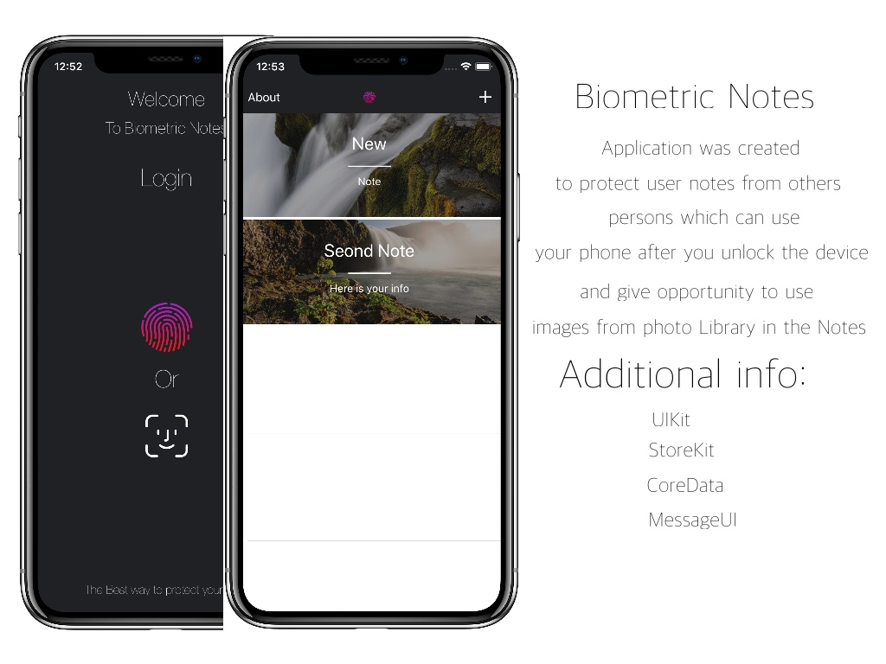

# Protected Notes Pro
This application give you opportunity to create a notes with pictures and secure them with your Biometric data(TouchID or FaceID )
App was created with Core Data and collecting full information which you put in the Notes and info will be available also after you close the app.

Like a backup for Login button working passcode.

Additional Preview Screenshot was hided in multitasking.

Version Swift:Swift 4
Version of Xcode:9.1

<h1>Application was sended for review in the AppStore 09.12.2017</h1>

  
Icon
  

  

